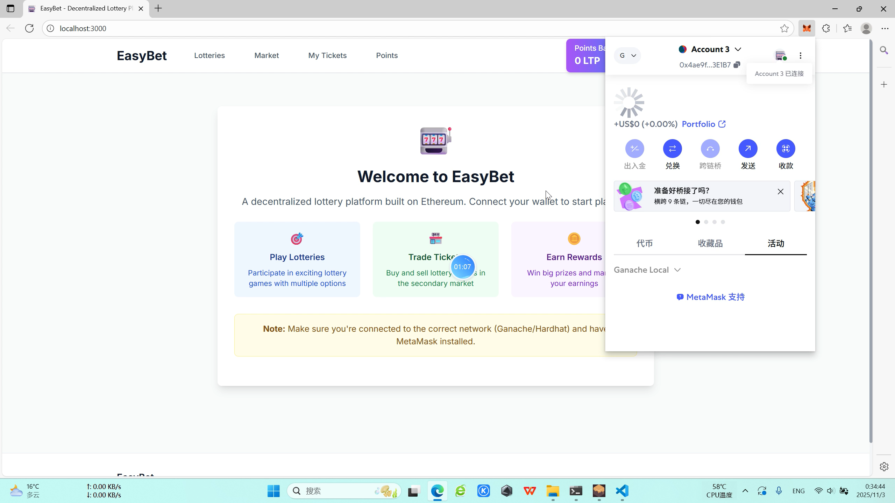
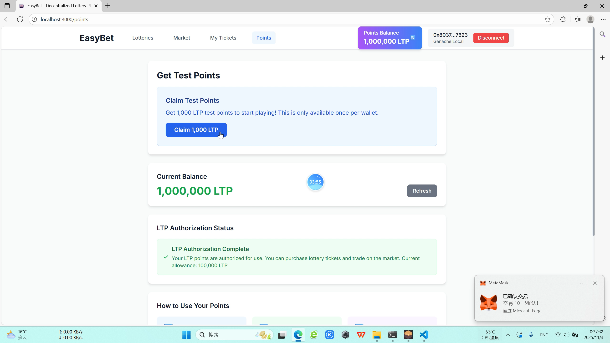
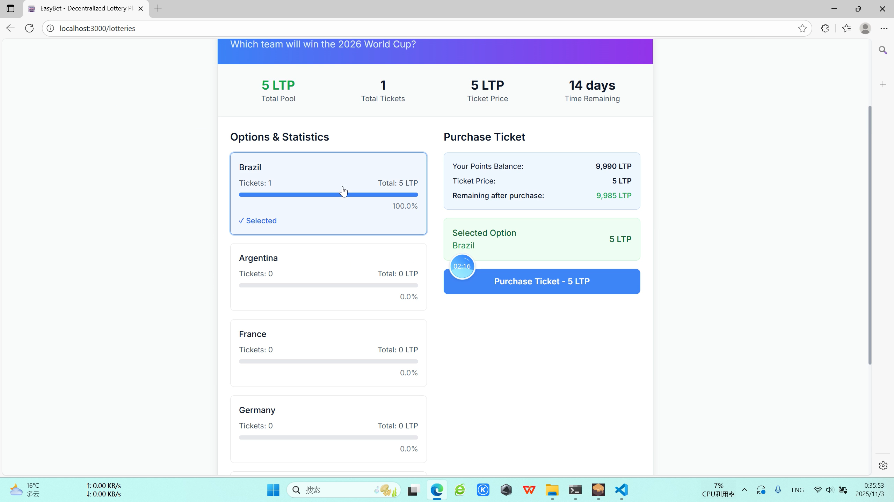
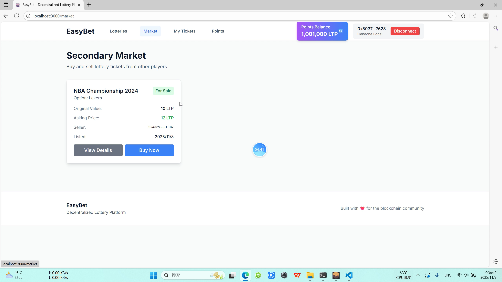
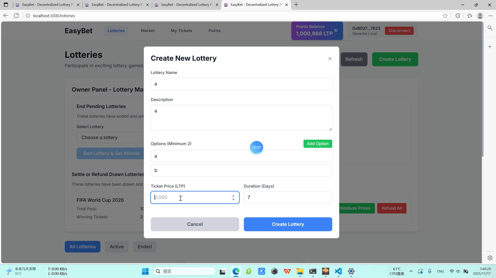

# EasyBet - 去中心化彩票系统

一个基于以太坊的进阶去中心化彩票平台，支持体育赛事、娱乐节目等各类竞猜项目的创建、交易和结算。

## 功能实现分析

### 核心功能实现

1. **ERC20积分系统 (Bonus功能)**
   - 实现 `LotteryPoints` 合约，用户可领取1000 LTP测试积分
   - 积分用于所有彩票购买和交易操作
   - 支持授权机制，确保安全的代币转移

2. **ERC721彩票凭证系统**
   - 实现 `LotteryToken` 合约，每个彩票对应一个NFT凭证
   - 彩票状态管理（Ready、OnSale、Winning、Losing）
   - 完整的NFT所有权转移和授权机制

3. **彩票项目管理**
   - 公证人可创建多选项彩票项目（最少2个选项）
   - 设置彩票价格、持续时间、总奖池
   - 实时显示各选项投注统计

4. **二级市场交易**
   - 玩家可挂单出售持有的彩票
   - 其他玩家可购买挂单的彩票
   - 完整的NFT转移和积分支付流程

5. **订单簿系统 (Bonus功能)**
   - 链上订单簿记录各价格水平的挂单数量
   - 支持按最优价格快速购买
   - 实时显示买卖盘口和价差

6. **公证人功能**
   - 结束彩票并公布获胜选项
   - 结算奖金分配（按投注比例）
   - 紧急退款功能

### 技术架构

**智能合约:**
- `DecentralizedLottery`: 主合约，管理所有业务逻辑
- `LotteryPoints`: ERC20积分代币合约
- `LotteryToken`: ERC721彩票凭证合约

**前端技术栈:**
- React + TypeScript + Vite
- Tailwind CSS 样式框架
- Ethers.js 区块链交互
- React Router 路由管理

## 如何运行

### 环境要求
- Node.js 16+
- MetaMask 钱包
- Ganache 本地区块链

### 后端合约部署

1. **启动 Ganache**
启动 Ganache 应用，设置端口为 8545，设置gas limit到一个足够大的值（默认值不够大）

2. **部署智能合约**
   ```bash
   cd contracts
   npm install
   npx hardhat compile
   npx hardhat run scripts/deploy-complete.ts --network ganache
   ```

3. **配置测试数据**
   - 部署脚本会自动创建测试彩票项目
   - 为测试账户分配初始积分
   - 自动设置合约间授权关系

4. **(可选)执行自动化测试**
   ```bash
   cd contracts
   npx hardhat run scripts/comprehensive-test.ts --network ganache
   ```

### 前端应用启动

1. **安装依赖**
   ```bash
   cd frontend
   npm install
   ```

2. **启动开发服务器**
   ```bash
   npm run dev
   ```
   应用将在 http://localhost:3000 启动

3. **连接钱包**
   - 在 MetaMask 中添加 Ganache 网络（Chain ID: 1337）
   - 导入 Ganache 提供的测试账户
   - 连接钱包到应用

## 项目运行截图
以下截图均来自本人录制的视频
### 1. 钱包连接界面


### 2. 积分领取页面


### 3. 彩票列表页面


### 4. 彩票详情页面


### 5. 二级市场页面


### 6. 我的票券页面


### 7. 公证人管理面板


### 8. 彩票创建页面


### 9. 票券出售页面

## 参考内容

- 课程的参考Demo见：[DEMOs](https://github.com/LBruyne/blockchain-course-demos)

- 快速实现 ERC721 和 ERC20：[OpenZeppelin Wizard](https://wizard.openzeppelin.com/#erc20)

- Ethers.js 文档：[官方文档](https://docs.ethers.org/v6/)

- Hardhat 开发框架：[官方文档](https://hardhat.org/)

## 项目特点

1. **完整的去中心化架构**: 所有核心逻辑都在链上执行
2. **用户友好的界面**: 直观的操作流程和状态显示
3. **安全的交易机制**: 完整的授权和转账验证
4. **实时数据更新**: 自动刷新合约状态和用户余额
5. **响应式设计**: 支持桌面和移动设备访问

## 注意事项

- 确保 Ganache 运行在端口 8545
- 首次使用需要授权合约使用积分和NFT
- 测试完成后可重新部署合约重置状态
- 所有交易需要确认并在区块链上记录
